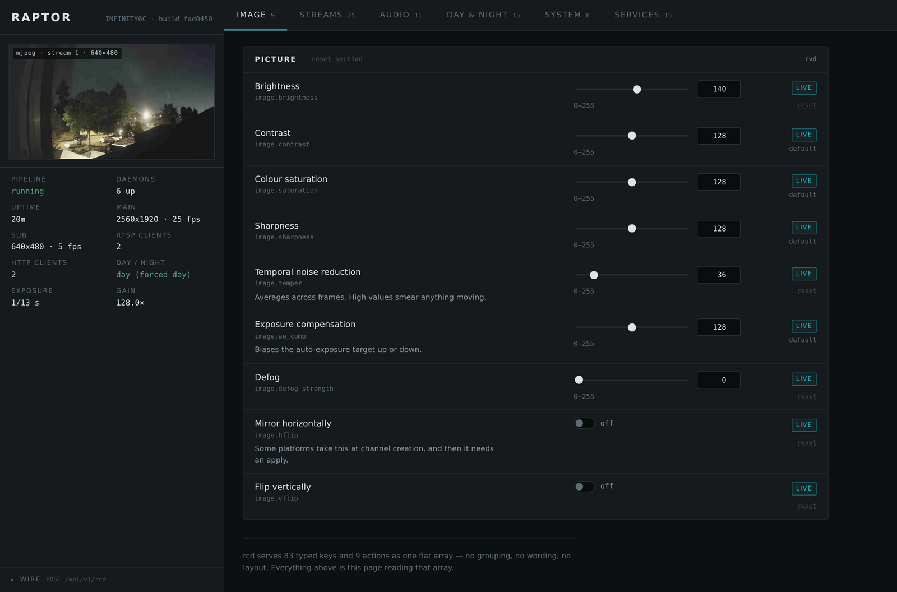

# openipc-raptor

A fork of [OpenIPC/firmware][upstream] that builds SigmaStar camera images
running **[Raptor][raptor]** as the streamer instead of Majestic. Raptor is
fully open source under the **GPL-3.0**, so unlike the closed binary it
replaces, everything that touches the camera here can be read, patched and
rebuilt.

Everything that is not Raptor is upstream's. This fork tracks
`OpenIPC/firmware` master and merges from it; the delta is a Raptor package,
two board targets, and a few SigmaStar fixes. Bug reports about anything else
belong upstream.



## What is different

**Raptor replaces Majestic as the streamer.** Where the stock image runs one
`majestic` process, these images run a set of small daemons that share frames
through POSIX shared-memory rings and talk over Unix control sockets. A crash
in the RTSP parser cannot take recording down with it, and nothing that reads
from the network shares an address space with the vendor SDK.

## Targets

| Board | SoC | Family | Rootfs |
|---|---|---|---|
| `ssc377qe_raptor` | SSC377QE | infinity6c  | 8192 KB |
| `ssc30kq_raptor`  | SSC30KQ  | infinity6e  | 8192 KB |
| `ssc333_raptor`   | SSC333   | infinity6b0 | 5120 KB |

All three are NOR. `make list` shows every board in the tree, upstream's
included.

`ssc333_raptor` is the odd one and worth reading its defconfig before copying
it: an 8MB part, where the other two are 16MB. U-Boot's two-layout rule cannot
hand out the larger rootfs on a chip that small, so 5120 KB is the partition
rather than a policy, and the image is built against that ceiling -- one sensor
tuning blob, no WireGuard, no exFAT, no vtund. It is also the only one whose
network is a USB radio (RTL8188FU) rather than Ethernet.

These are the boards that get tested, not the limit of what works. The
package picks its backend from `BR2_OPENIPC_SOC_FAMILY` and the HAL is written
per family rather than per board, so **any infinity6c, infinity6e or
infinity6b0 board should build and run**. Adding one is a defconfig: copy the
stock `_lite_defconfig` for that board, swap `BR2_PACKAGE_MAJESTIC` for
`BR2_PACKAGE_RAPTOR_STREAMING`, and set
`BR2_OPENIPC_VARIANT="raptor"`. What differs between boards of one family --
sensor, i2c bus, IR-cut GPIO, audio codec -- lives in `raptor.conf` rather than
in code, and the sensor is probed at runtime.

**Ingenic should be close to free.** Raptor started on Ingenic and its HAL
still carries T10 through T41; this fork only added the SigmaStar side.
`RAPTOR_STREAMING_PLATFORM` is the SoC family uppercased, so a `t31` board
already resolves to the `T31` backend with no change to the package. What is
missing is a defconfig selecting raptor-streaming on an Ingenic target, and a
route to the Ingenic SDK headers -- the HAL expects them at `INGENIC_HEADERS`
and this package does not pass it. Untested: there is no Ingenic hardware on
this bench.

## Daemons in these images

Raptor is modular and each image installs only what it needs. These boards
ship:

| | Role |
|---|---|
| `rvd` | Owns the ISP, sensor and encoders. Publishes the `main`, `sub`, `jpeg0` and `jpeg1` rings. The only daemon that touches the vendor SDK. |
| `rsd` | RTSP/RTSPS, Digest auth, ONVIF Profile T audio backchannel. |
| `rad` | Audio capture and encode (G.711, L16, AAC, Opus), speaker output. |
| `rod` | Renders OSD text and logos into shared buffers; no hardware dependency. |
| `ric` | IR-cut day/night control -- luma plus gain-ratio, or an ADC or GPIO sensor. |
| `rhd` | HTTP: JPEG snapshots, MJPEG, audio, and the configuration console. |
| `rcd` | Owns `raptor.conf`. Validates against a published schema, applies what a running daemon can take live, and sequences the restarts for what it cannot. |
| `rmq` | MQTT bridge with Home Assistant discovery. |
| `raptorctl` | Command-line client for all of the above. |

## Building

```sh
make BOARD=ssc377qe_raptor all
```

That leaves the kernel, the rootfs and an installable archive in
`output/images/`:

```
uImage.ssc377qe
rootfs.squashfs.ssc377qe
openipc.ssc377qe-nor-raptor-<build-id>.tgz
openipc.ssc377qe-nor-raptor-latest.tgz -> the build above
```

`make BOARD=ssc377qe_raptor fullimage` then assembles the whole-flash
`openipc-ssc377qe-nor-full.bin` from those pieces plus the bootloader the
build already produced. See Installing for which of the two you want.
`make help` covers the other targets.

### Nightlies

`.github/workflows/raptor-nightly.yml` builds both boards and publishes both
artefacts to the rolling `raptor-nightly` release. It runs on a schedule but
only builds when the image would actually differ: Raptor is four commit pins
rather than a moving branch, so an image is a function of this repository's
HEAD, and the gate compares HEAD and the pin list against what the previous
nightly recorded in its own release notes. A quiet week publishes nothing.

Upstream's `build.yml` is untouched, and its schedule still does nothing here
-- it is gated on the canonical repository on purpose, so a clone cannot spend
its owner's Actions minutes on a 96-board matrix unattended.

### Where Raptor comes from

The package fetches four pinned commits from `github.com/johnchia` --
`raptor`, `raptor-hal`, `raptor-common`, `raptor-ipc` -- so a build needs no
checkout. There is a fifth pin, `sigmastar-headers`, because GitHub's source
archives omit submodule contents and `raptor-hal` reaches the MI ABI
declarations through one. It must be re-read from the gitlink whenever the HAL
pin moves:

```sh
git -C raptor-hal ls-tree <hal-pin> sigmastar-headers
```

All five live in `general/package/raptor-streaming/raptor-streaming.mk`, which
documents the coupling at length. The build directory is named after the
**raptor** pin alone, so run `make BOARD=<board> br-raptor-streaming-dirclean`
first whenever any of the other four moves.

## Installing

Two artefacts, and which you need depends on what the camera runs now:

| | Use it when |
|---|---|
| `openipc.<soc>-nor-raptor-<id>.tgz` | The camera already runs this firmware. `sysupgrade` takes it directly. |
| `openipc-<soc>-nor-full.bin` | It runs the factory firmware, or the flash is in an unknown state. A whole-flash image, bootloader included, written with a programmer or from U-Boot. |

Both come out of a local build, and both are published by the nightly on the
rolling `raptor-nightly` release.

`sysupgrade` takes the archive the build just produced. It checks the md5 of
each part and the SoC each was stamped for, then pivots into a ramfs so it is
not reading from the partition it is about to write:

```sh
scp -O output/images/openipc.ssc377qe-nor-raptor-latest.tgz root@<board>:/tmp/fw.tgz
ssh root@<board> 'sysupgrade --archive=/tmp/fw.tgz'
```

The board reboots itself. `cat /etc/os-release` afterwards says which build
actually came up -- worth checking, because a kernel whose build id matches the
running one is skipped with `Same version, nothing to update` and the reboot
happens anyway. Add `--force_ver` to reflash an identical build.

To write a single partition -- a kernel-only change, or a board that will not
boot far enough to run `sysupgrade` -- `flashcp` does it directly:

```sh
scp -O output/images/uImage.ssc377qe          root@<board>:/tmp/uImage
scp -O output/images/rootfs.squashfs.ssc377qe root@<board>:/tmp/rootfs.sq

ssh root@<board> '/etc/init.d/S95raptor stop'
ssh root@<board> 'flashcp /tmp/uImage /dev/mtd2'      # kernel
ssh root@<board> 'flashcp /tmp/rootfs.sq /dev/mtd3'   # rootfs

# verify against the exact byte count -- reading further returns 0xff padding
ssh root@<board> 'head -c <bytes> /dev/mtd2 | md5sum'
ssh root@<board> 'head -c <bytes> /dev/mtd3 | md5sum'
ssh root@<board> reboot
```

Use `head -c`, never `dd bs=<size> count=1`: `dd` takes one short read from an
mtd character device and hashes a partial block.

## Configuring a running camera

`rcd` owns `/etc/raptor.conf`. Three clients reach it, and none of them writes
the file themselves:

- **Web console** -- `http://<camera>:8080/`, the page above. It is rendered
  from `rcd`'s own schema, so the form comes from the camera rather than a
  second copy of the key table.
- **`raptorctl`** on the camera: `raptorctl config get|set|apply|pending`.
- **MQTT**, through `rmq`.

A `set` never restarts anything. Keys a running daemon can take live are
applied immediately; the rest are written and their owner recorded as running
behind, and `apply` is the explicit step that enacts the difference.

### Authentication

Two credentials, deliberately separate:

- **The system account** (`/etc/shadow`) authenticates the configuration API,
  `POST /api/v1/rcd`, and nothing else authenticates it. That route can rewrite
  the network stanza and restart the pipeline, so it takes the one secret on
  the camera that is not also handed out to watch video.
- **`[rtsp]` and `[http]` username/password** are the media credential --
  RTSP Digest and HTTP Basic for snapshots and MJPEG. `rcd` writes both
  sections from one value so a camera has one viewing account rather than two
  that drift. This credential does **not** open the configuration API.

Both are unset in a fresh image, which means media is served without
authentication until you set it, and the configuration API is protected by
whatever the root password is. **Change the root password.** The stock image
ships the hash published in OpenIPC's repository.

## Licence and credit

This build tree is MIT, inherited from upstream OpenIPC. **Raptor itself is
GPL-3.0** -- all four of its repositories are -- so an image built here mixes
the two, and the Raptor daemons carry GPLv3 obligations that the rest of the
tree does not.

OpenIPC is the reason any of this boots at all: kernel, bootloader, vendor
packaging, and the Buildroot tree are theirs. See the [project][project], the
[website][website] and the [wiki][wiki], and consider supporting them at
[Open Collective][opencollective].

[opencollective]: https://opencollective.com/openipc
[project]: https://github.com/openipc
[raptor]: https://github.com/gtxaspec/raptor
[upstream]: https://github.com/OpenIPC/firmware
[website]: https://openipc.org
[wiki]: https://github.com/openipc/wiki
